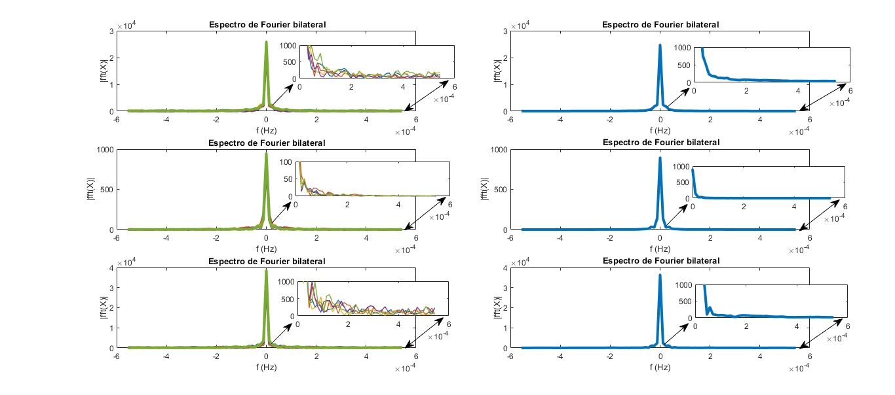

# 📊 Análise Espectral de Dados Ionosféricos com FFT

Script MATLAB para análise espectral de parâmetros ionosféricos usando Transformada Rápida de Fourier (FFT).

## 🚀 Tecnologias Usadas

- **MATLAB**
- **Gráficos e Visualização de Dados**

## 💡 Objetivo

O objetivo deste projeto foi desenvolver um código para:
- Carregamento de dados ionosféricos de arquivos TXT
- Cálculo da FFT para três parâmetros (hF, f0F2, hmF2)
- Visualização de espectros unilateral e bilateral
- Análise comparativa entre parâmetros

## 📊 Parâmetros Analisados

| Parâmetro | Descrição          | Unidade |
|-----------|--------------------|---------|
| hF        | Altura do ponto F  | km      |
| f0F2      | Frequência crítica | MHz     |
| hmF2      | Altura de pico F2  | km      |

## 📜 Como Usar

1. Coloque o arquivo `DIAS_CALMOS(DDD).TXT` na mesma pasta do script
2. Execute o código no MATLAB
3. Visualize os gráficos gerados

## 📜 Licença

Este projeto está licenciado sob a Licença MIT - veja o arquivo LICENSE para mais detalhes.

## 📌 Exemplo de Saída

  

